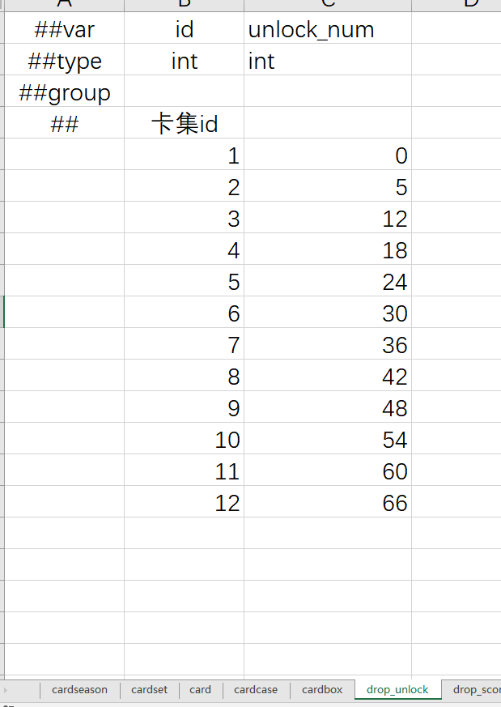
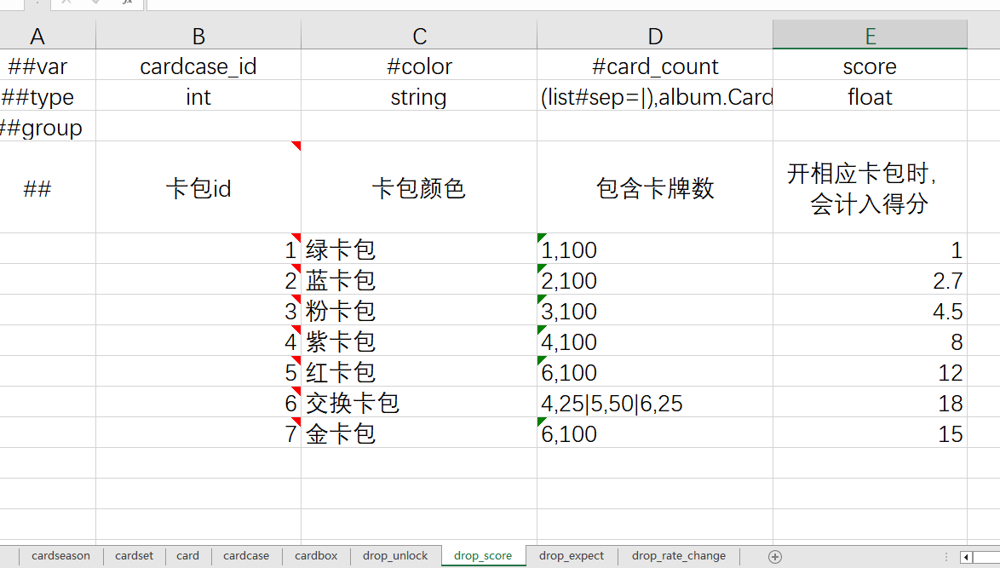
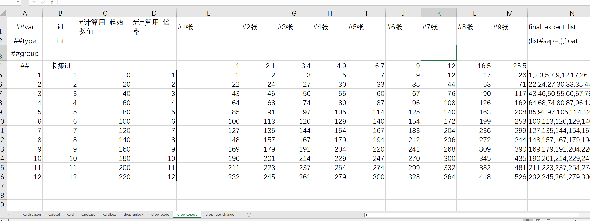
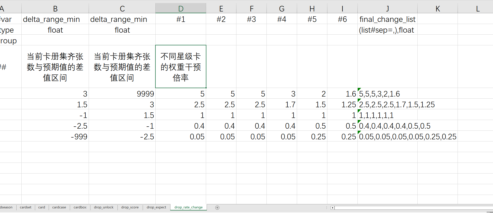
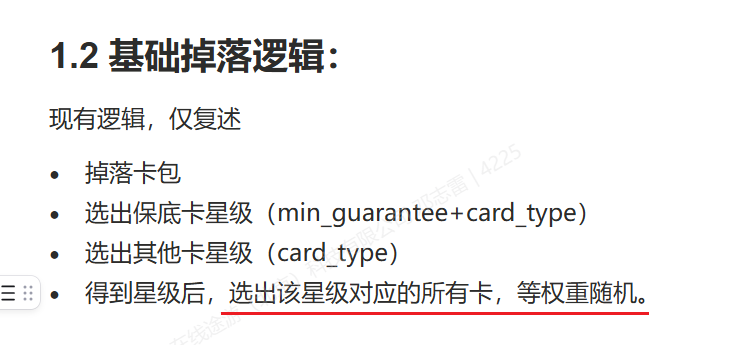

# 卡册掉落优化逻辑

> 来源：[钉钉文档](https://alidocs.dingtalk.com/i/nodes/YQBnd5ExVEwPxjjdT0G4qNgG8yeZqMmz)
> 解析时间：2026-04-09

## 概述

本文档描述卡册（Album）系统的掉落优化机制，核心目标是通过**动态卡池**和**基于收集进度的权重调控**，优化新玩家首个赛季首轮卡册的集卡体验。包含三个主要机制：动态 Set 解锁、基于开卡包分值的期望收集进度计算、以及根据偏差值动态调整未收集卡牌的出现权重。

---

## 1. 前情提要

### 1.1 名词定义

- **Album**：整个卡册
- **Set**：1 个 Album 里有 **12 个 Set**
- **Card**：1 个 Set 里有 **9 张 Card**

### 1.2 基础掉落逻辑

现有逻辑（仅复述）：

- 掉落卡包
- 选出保底卡星级（`min_guarantee` + `card_type`）
- 选出其他卡星级（`card_type`）
- 得到星级后，选出该星级对应的所有卡，**等权重随机**

---

## 2. 基础设定

暂定以下调控机制：

> **仅针对新玩家首个赛季首轮卡册生效**

- 配置表加个适用玩家的注册时间条件
- 不过不排除以后扩展到其他轮次也用

---

## 3. 新增动态卡池设计

### 3.1 规则

- 玩家**初始卡池仅有第 1 个 Set** 的卡
- 当玩家每集卡（不重复卡张数）到一定进度，才会逐级解锁新的 Set

### 3.2 兼容处理

如果获得一张高星级卡，当前解锁的 Set 里都没有这个星级的卡，那么就还是走**全体卡池**。

---

## 4. 根据玩家开卡包数量动态控制新卡出现权重机制

### 4.1 已开卡包数（分值）

根据该表配置，**每次开卡包时，会累计分值**，用于计算预期玩家的收集进度。

> **该分值，每次集齐卡册后重置，每个新赛季也重置。** 即使我们这个调控逻辑只针对第一个卡册，但是这个参数还是一个比较好的玩家当前投入精力程度的一个指标，**所以也都先记录着，以备以后用**。

### 4.2 期望收集进度

遍历 12 个 Set，根据上文的已开卡包分值，计算每个 Set 期望的收集张数。

**计算示例：**
- 已开卡包分值 = 10
- Set1 的期望张数 = `6 + (12 - 10) / (12 - 9) = 6.6` 张（线性插值计算）

同理，计算出 Set1 ~ Set12 的期望张数。

然后分别与当前已收集张数做差值，得到 Set1 ~ Set12 的**收集预期偏差值**（期望张数 - 实际张数）：
- **为正** → 收集进度不够，需**促进**
- **为负** → 进度过高，需**抑制**

### 4.3 根据偏差值修改权重

根据上文计算的偏差值，干预各个卡册里的**未收集齐的卡牌的出现权重**。

即影响下面这一步的权重：

> **最终权重 = 初始权重 × 干预倍率**

---

## 5. 增加直接加卡包的 GM 测试工具

（待补充具体内容）
